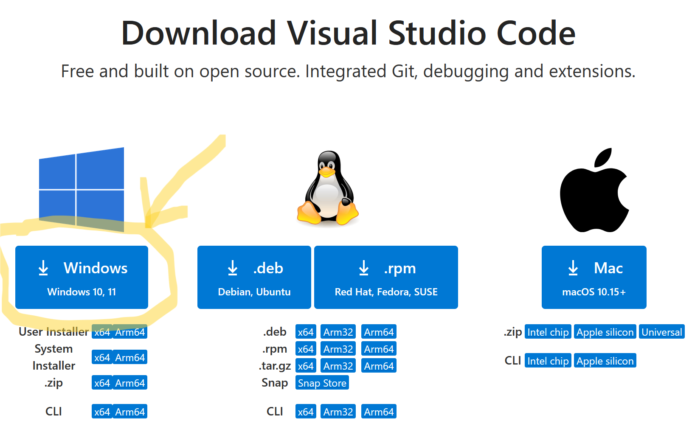
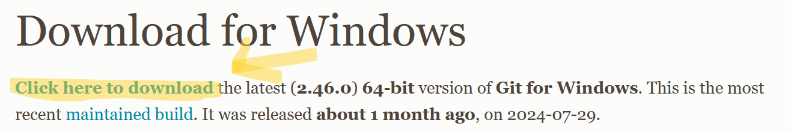
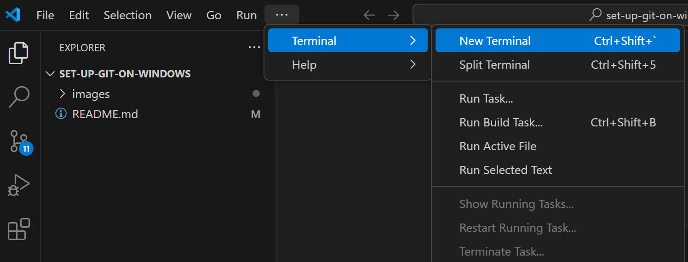
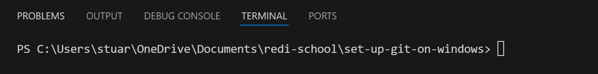
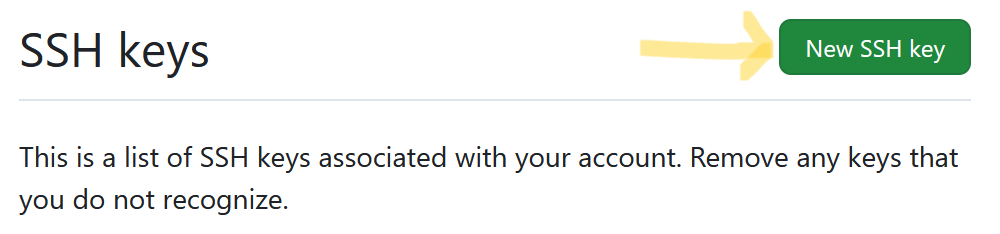
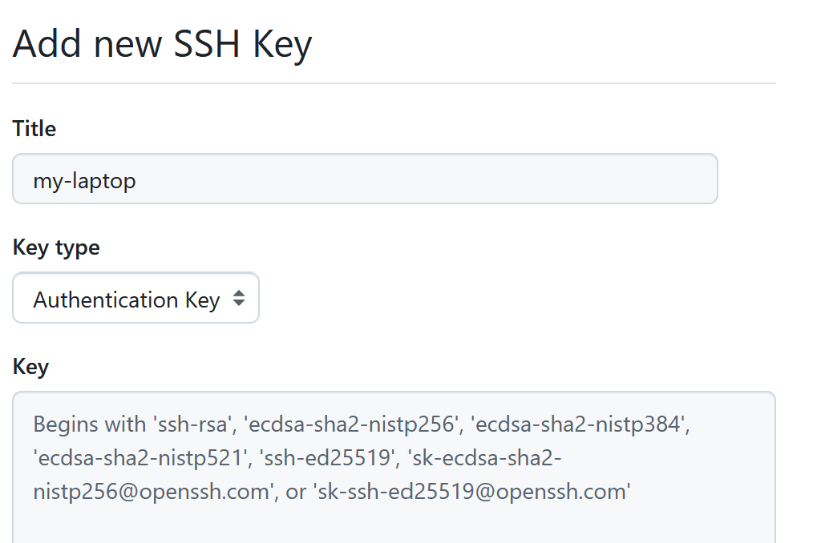
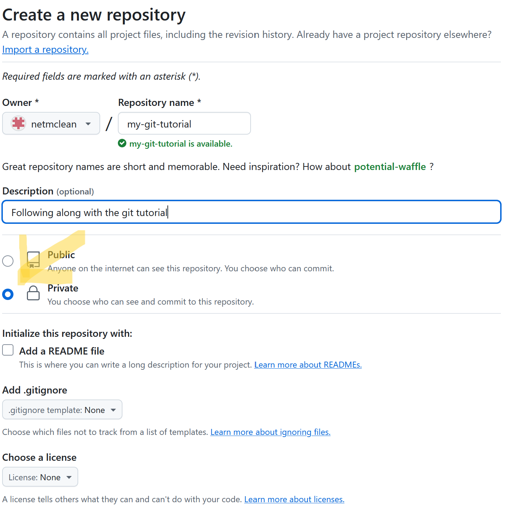
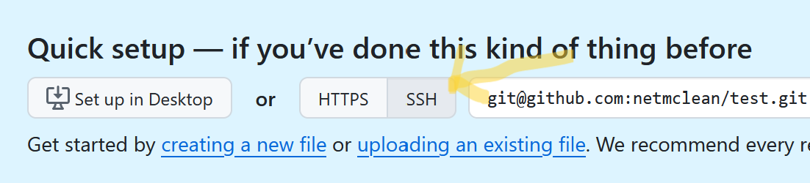

# How to set up Git and Github on Windows (along with Visual Studio Code)

### Initial Recommendations
- Use Chrome or Firefox as your web-browser
- Use a password manager, such as [1password](https://1password.com/), to generate and store your passwords

## Part 1 - Setting up Visual Studio Code
Visual Studio Code is an IDE (Integrated Development Environment) that helps us to write code and interact with various other tools that help with this process.

### Download Visual Studio Code:
- go to https://code.visualstudio.com/download

- once everything is downloaded, double-click the `VSCodeUserSetup<version-numbers>.exe` file
- use all the default settings
- open Visual Studio Code to check that it works.

## Part 2 - Setting up Git
Git is a free and open source distributed version control system designed to handle everything from small to very large projects with speed and efficiency.
### Download and install Git:
- go to https://git-scm.com/download/win
- the first download link should be fine for all laptops released in the last 10 years

- after clicking install, windows will ask "Do you want to all this app to make changes to your device?" - click yes
- follow the installation guide, using all the default settings (no need to check or uncheck any boxes)

## Part 3 - Setting up GitHub
GitHub is where over 100 million developers contribute to the open source community and manage their Git repositories.
### Create your GitHub account:
- go to https://github.com
- if you don't have an account, sign up - use a long, unique password - best if generated by a password keeper like [1password](https://1password.com/)
- please take a minute to visit https://github.com/settings/security to set up 2-factor authentication using your password keeper or an app like "google authenticator"

### Create an SSH key:
`ssh` is short for "Secure Shell" if you want to learn more about `ssh`, [this](https://learn.microsoft.com/en-us/viva/glint/setup/sftp-ssh-key-gen) is a good place to start.
- open Visual Studio Code
- from the "Terminal" menu, select "New Terminal" - a window should open up at the bottom of your screen

- this will bring up a command-line prompt that will look something like the image below - time to show off your best hacking skillz.

- type `ssh-keygen -t ed25519 -C "your_email@example.com"` and press enter (return) - you will be prompted to enter and then reenter a password - best if this password is also a long, randomly generated password stored in a password keeper.
### Save your public key in GitHub:
- copy your public key to the clipboard with `Get-Contents ~\.ssh\id_rsa.pub | clip`
- in your web-browser, go to https://github.com/settings/keys and click on "New SSH Key"

- you can then add a new ssh-key - pasting the contents of your clipboard into the "Key" field
- leave "Key type" as "Authentication Key"
- set the title to something like "my-computer"

- remember, it's safe to share `~/.ssh/id_rsa.pub` (the ".pub" is short for public) with others, but you should never, ever share `~/.ssh/id_rsa` with anyone. The file without ".pub" is known as your "private key".

### Testing your connection to github
- in the VisualStudio Code terminal, type: `ssh -T git@github.com`
- If this is your first time connecting, you might see a message asking if you want to continue connecting. Type `yes` and press enter.
- You should see a message like this:
```shell
Hi username! You've successfully authenticated, but GitHub does not provide shell access.
```

## Part 4 - Joining it all together
### Create a new folder for your project:
- create a new folder in your "Documents" folder called "redi-school"
- create a new folder in your "redi-school" folder called "git-tutorial"
### Create a project file:
- open Visual Studio Code
- choose "open folder" from the "file" menu
- select your folder at "~\Documents\redi-school\git-tutorial"
- choose "New File..." from the "File" menu
- name the new file `README.md`
- double click on `README.md` to open it and type "Hello World" in it
- save the file with `ctrl+s` or by choosing the "save" option from the "file" menu.
### Set up your git user configuration:
- in Visual Studio Code, open the terminal (if it isn't open already)
- prepare a basic user configuration (you only have to do this once):
    - type: `git config --global user.email "your_email@example.com"`
    - type: `git config --global user.name "Monty Python"`
- verify that your user configuration is correct by typing: `git config --list`
### Initialize a local Git repository and 'commit' your README file:
- initialize your repository by typing: `git init`
- add your file with `git add .`
- create your first commit by typeing: `git commit -m "hello world"`

### Create a new project on GitHub:
- in your web-browser, go to https://github.com/new
- call your project `git-tutorial` - use the default settings but select the "private" button

- under "Quick setup — if you’ve done this kind of thing before", click the "SSH" button.

- copy the suggested commands in the section with this header: "...or push an existing repository from the command line" - these should be something like:
```
git remote add origin git@github.com/<your_github_username>/git-tutorial.git
git branch -M main
git push -u origin main
```

### Push your local project to GitHub:
- open Visual Studio Code and its terminal
- paste in the lines you got from GitHub - NOTE: you will probably need to enter your SSH password at this point.
- back in your browser, refresh the GitHub webpage
- if all went well you should see your `README.md` file

## Part 5 - Celebrate
Congratulations! You're all set up to start contributing to software projects!

For more advanced Git usage, consider browsing the free [GitBook](https://git-scm.com/book/en/v2) - available in a number of language - or GitHub’s own [documentation](https://docs.github.com/en).
